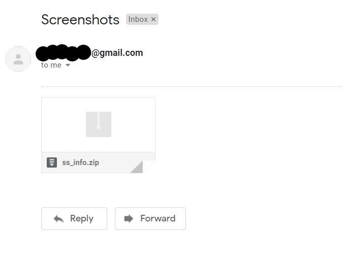
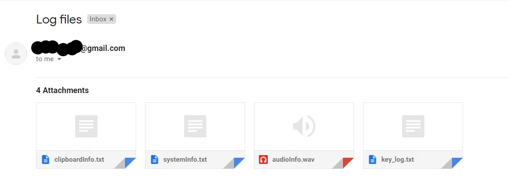
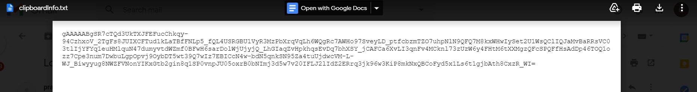

# Advance-Keylogger-in-Python

It is a Advance keylogger written in python.
* It does basic keyword capturing.
* It also takes screenshots at given time and also record the microphone.
* Along with it, it also caputres PC configurations, clipboard data.
* At last all data is encrypted, so if user finds out files one can not understand.

## Example

Encrypted Files example

